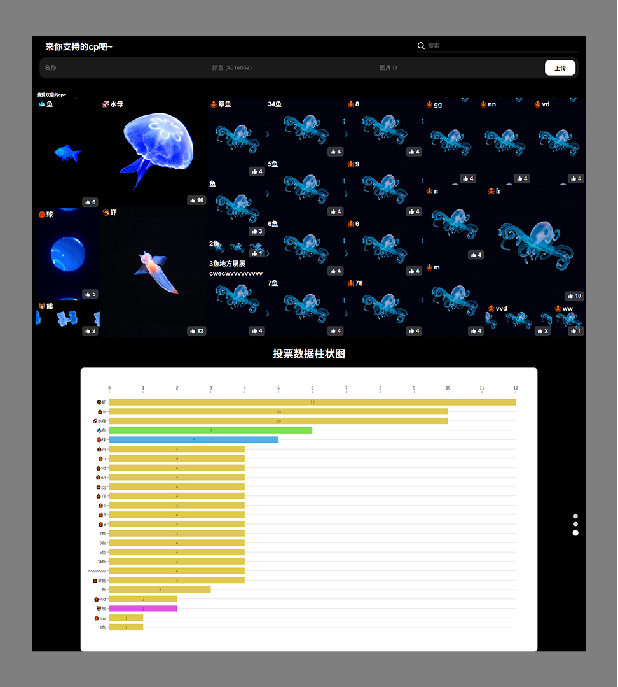

# Rhymoss AI 同人CP投票系统



## 📌 项目背景

这是为 Rhymoss AI 搜索同人网站打造的宣传互动页面。通过趣味投票功能吸引用户参与、探索并贡献更多CP内容。并未投票数多的cp用户发放免费使用次数。

用户可以：
- ✅ 为自己喜欢的同人CP投票
- 📊 实时查看投票分布图
- ➕ 添加新的CP候选项

---
图片展示链接：
https://www.figma.com/design/IyrhiRa8QHuj1mToV331Tj/Rhymoss%E9%A6%96%E9%A1%B5?node-id=1174-42482&t=elwyU2tIViepSiwg-1

## ✨ 功能特性

### 可视化展示
- 🌳 **动态树状图**：面积大小动态反映票数多少，互动式节点高亮
- 📈 **横向柱状图**：条形对比，便于观察热度差异
- 🔁 **实时刷新**：每秒自动轮询，展示最新投票情况

### 交互功能
- 👍 一键投票（无刷新提交）
- 🔍 实时搜索匹配CP名
- 📝 提交新CP，审核通过即刻上榜

---

## 🛠 技术栈

| 类别       | 技术选型                  |
|------------|--------------------------|
| 前端框架   | React 18                 |
| 可视化库   | @nivo/treemap, @nivo/bar |
| 样式方案   | CSS Modules              |
| 后端框架   | FastAPI                  |
| 数据验证   | Pydantic                 |
| 构建工具   | Vite                     |

---

## 🖥 界面展示

### 主界面布局结构

```
[Header表单区]
├── 搜索框
└── 新增CP表单

[Treemap可视化区]
└── 动态交互树状图

[BarChart展示区]
└── 横向柱状图（支持分页与高亮）
```

---

## ⚙️ 安装运行指南

### 前端

```bash
npm install
npm run dev
```

### 后端

```bash
pip install fastapi uvicorn
uvicorn main:app --reload
```

---

## 📂 项目主要结构概览

```
src/
├── assets/                 # 静态资源
├── components/             # 组件库
│   ├── Treemap/            # 树状图组件
│   │   ├── Treemap.jsx
│   │   └── Treemap.module.css
│   ├── BarChart/           # 柱状图组件
│   ├── FormPage/           # 搜索+新增表单
│   └── SearchModal/        # 搜索弹窗
├── App.jsx                 # 根组件
└── main.jsx                # 应用入口
```

---

## 🔄 数据流程图

```
用户操作 → 前端状态管理 → 后端API接口 → 实时可视化更新
```

---

## 🚀 性能优化策略

- ⏱ **防抖处理**：搜索输入节流至 500ms
- 📜 **虚拟滚动**：优化长列表渲染性能
- 👀 **按需渲染**：小尺寸节点不显示文字，避免信息干扰
- 💾 **缓存策略**：高频数据本地缓存提升响应速度

---


## 📡 API接口文档

| 端点              | 方法   | 描述             |
|-------------------|--------|------------------|
| `/api/votes`      | GET    | 获取所有投票项    |
| `/api/vote/{id}`  | POST   | 为指定ID投票      |
| `/api/vote/new`   | POST   | 新增CP选项        |

---

## 📅 后续开发计划

- 🔐 图片上传功能
- 📤 搜索结果投票功能

---

## 🤝 参与贡献指南

1. Fork 本项目仓库
2. 创建特性分支 `git checkout -b feature/xxx`
3. 提交更改 `git commit -am 'Add some feature'`
4. 推送到分支 `git push origin feature/xxx`
5. 创建 Pull Request 📬

---

> 本项目为 Rhymoss AI 推广同人内容的一部分，旨在用 AI + 可视化 提高用户互动与探索兴趣。
